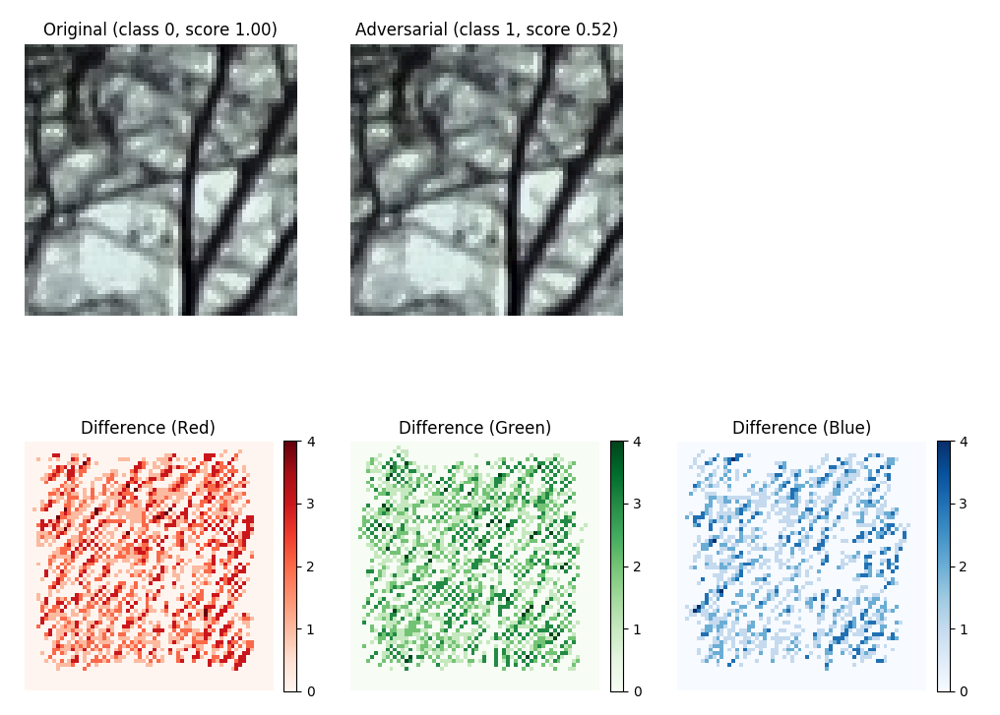

# Pixel-Domain Gradient Descent CNN Attack Implementation (Keras)

This program is free software: you can redistribute it and/or modify
it under the terms of the GNU General Public License as published by
the Free Software Foundation, either version 3 of the License, or
(at your option) any later version.

This program is distributed in the hope that it will be useful,
but WITHOUT ANY WARRANTY; without even the implied warranty of
MERCHANTABILITY or FITNESS FOR A PARTICULAR PURPOSE.  See the
GNU General Public License for more details.

You should have received a copy of the GNU General Public License
along with this program.  If not, see <https://www.gnu.org/licenses/>

If you are using this software, please cite:

    [B. Tondi, “Pixel-domain Adversarial Examples Against CNN-based Manipulation Detectors", 
    Electronics Letters, 2018, DOI 10.1049/el.2018.6469](http://clem.dii.unisi.it/~vipp/files/publications/IETletter_CNNattacks_final.pdf)
<br>

## Installing dependencies

To install the packages required by our software, you may use the provided *requirements.txt*;
feel free to edit or ignore the file but keep in mind that we tested our codes only on the package 
versions that you find in it:

```
$ python3 venv /myvenv
$ source ./myvenv/bin/activate
$ pip install -r requirements.txt
```
We tested our code on Python 3.5-3.6 on Ubuntu 18.04 and Windows 10 (64 bit editions).

<br>

## Downloading provided CNN models
To run the attack, we provide the CNN model described in this paper:

[M. Barni, A. Costanzo, E. Nowroozi, B. Tondi., “CNN-based detection of generic contrast adjustment with
JPEG post-processing", ICIP 2018](http://clem.dii.unisi.it/~vipp/files/publications/CM-icip18.pdf)

Source code of the network can be downloaded [here](https://github.com/andreacos/ContrastNet). This network
discriminates between pristine RGB images and images that undergo contrast-adjustment manipulations (gamma correction,
adaptive histogram enhancement, histogram equalisation), either JPEG compressed or uncompressed. Model's input size is
64x64x3.

[Download model here](http://clem.dii.unisi.it/~vipp/github/model_keras_ICIP18_64x64x3.h5) (55MB) and 
copy it to *models/* directory 

Alternatively, run the provided *download_model.py* script:
```
$ cd models
$ python3 download_model.py
```

<br>

## Running the attack

An example is provided in *Demo.py*. The attack works both for single-channel grayscale images and RGB images. 
``` 
    # Color demo
    model_file = 'models/model_keras_ICIP18_64x64x3.h5'
    img_file = 'resources/sample_color_clahe.png

    # Grayscale demo
    # model_file = 'models/<my_grayscale_keras_model.h5>'
    # img_file = 'resources/<my_grayscale_sample_image>'
``` 
We first load the *Keras* model we want to fool. If the model was trained with softmax in the last layer, we switch that with linear activations
```
    model = load_model(model_file)
    model = force_linear_activation(model=model, savemodel=None)
```   
Then we load an image, either grayscale or RGB, whose ground-truth class is known. <b>Note: if you are using the models we provide, then label=0 for manipulated images and label=1 for pristine images</b>
```
    img = imread(img_file)

    # True label: this is your ground truth!
    true_class = 0
```
Note that we require that input image's shape is *(rows, columns, channels)*. This is obvious for RGB images but in case of grayscale images, we need to 
reshape *(rows, cols)* to *(rows, cols, 1)*
```
    if len(img.shape) == 2:
        img = np.expand_dims(img, -1)
```
We also make sure that input image shape is the one the to-be-fooled CNN model is expecting
```
    assert img.shape == model.layers[0].input_shape[1:]
```

We classify the input image. <b>Note that we preprocess input values by scaling them by 1/255
because this is the same (and only) operation we carried out during training of our models. Remember to modify this preprocessing according to your own models</b>
```
    pred_score = model.predict(np.expand_dims(img.astype('float32'), axis=0) / 255, verbose=0)
    pred_class = np.argmax(pred_score)
```
We attack the image only if the model does not miss-classifies it already
```
    if pred_class != true_class:
        print('Input image is already miss-classified: there is no need to attack')
    else:
        ...
```
The attack's usage is pretty straightforward: initialise parameters and run
```
    gdm = PixelDomainAttackMethod(model=model, delta=1, max_no_it=20, T=100, k_stop=.8, k_increment=.002)
    adv_img, _, _, it_number = gdm.generate_attack(x=img)
```
Check the class score and label of the adversarial image (scaling by 1/255 as before)
```
    adv_score = model.predict(np.expand_dims(adv_img.astype('float32'), axis=0)/255.)
    adv_class = np.argmax(adv_score)
```
Finally, we visualise the (integer) difference between input image and adversarial image). 
```
    show_figures(img.squeeze(), adv_img.squeeze(), softmax(pred_score[0]), softmax(adv_score[0]))
```
Note that difference image *np.abs(img - adv_img)* is enhanced with false colors for the sake of visualisation.

RGB:


Grayscale:


<br>

## Evaluating attack performance

We provide a *Script.py* where the procedure in *Demo.py* is applied to a directory of images and its performance are
evalutated. Note that we assume that all images in input directory belong to the same class, whose gound truth label
is known. 

The script produce a lot of textual logging information, it may be useful to redirect it to a text file.
```
$ python3 Script.py 2>&1 | tee /path/to/logfile.log

```

Logfile.log:

```
Found 200 images in directory /media/D/Datasets/OriginalVSclahe_clip5_png/64x64/test/clahe/*.*

   > All images loaded.
Testing input images
   > Accuracy on legitimate images (all): 1.0000
Attacking input images
   > Excluding 0 images that were not classified correctly (no need to attack)
   > Image rf4a7056bt.TIF_crop129.png
Starting attack iterations:
 > Iteration #1.. 
 > Iteration #2.. 
 > Iteration #3.. 
 > Iteration #4.. 
 > Iteration #5.. 
 > Iteration #6.. 
 > Iteration #7.. 
      > Class changed from [0] to [1] after 7 iterations
      > Score changed from [1. 0.] to [0.49343276 0.50656724]
      > Max distortion = 7.0000; L1 distortion = 1.2730
      > % of modified pixels on integers = 0.3994. % of negative modifications = 0.0000
   > Image rf4a7056bt.TIF_crop142.png
Starting attack iterations:
 > Iteration #1.. 
 > Iteration #2.. 
 > Iteration #3.. 
 > Iteration #4.. 
 > Iteration #5.. 
      > Class changed from [0] to [1] after 5 iterations
      > Score changed from [1.0e+00 5.2e-44] to [0.4962672 0.5037328]
      > Max distortion = 5.0000; L1 distortion = 0.9928
      > % of modified pixels on integers = 0.3779. % of negative modifications = 0.0000
   > Image rf4a7056bt.TIF_crop38.png
   
   ...
   ...
   
Attack failed 0 times out of 50
Average distortion: max dist 5.4, L1 dist 0.9446891276041669
Average no of modified pixels: 0.38159179687500006
Accuracy on legitimate images (all): 1.0000
Accuracy on adversarial images: 0.0000
```